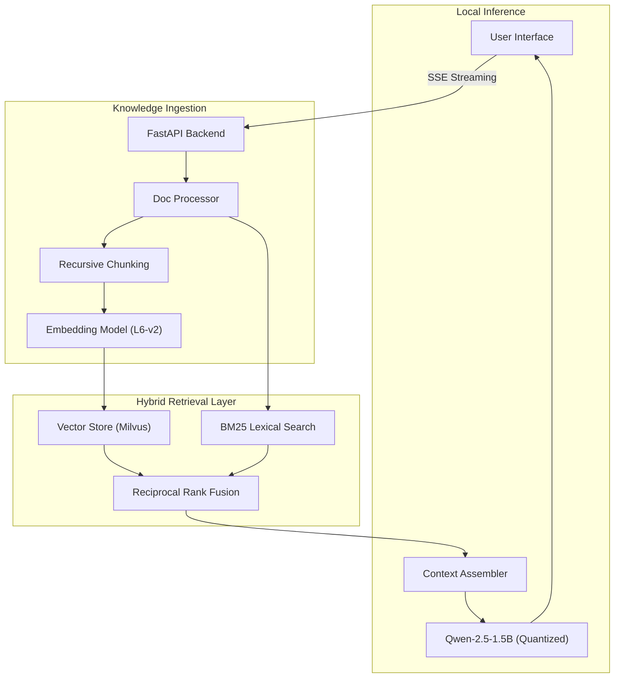

# 🤖 Chat With Your Docs: Private & Advanced RAG

> **100% Local. Zero API Keys. Production-Grade Engineering.**

A powerful AI assistant that lets you chat with your PDFs and documents effortlessly. Built it to demonstrate a commitment to security, precision, and engineering excellence.

---

## 📽️ What is this?

Think of this as your private version of ChatGPT, but exclusively for your own documents. 
Unlike other systems that send your data to the cloud, **this system runs entirely on your machine.** Your documents never leave your local environment.

### Why this project stands out:
*   **Hybrid Intelligence**: Uses both keyword matching and semantic meaning to find answers.
*   **Total Privacy**: No OpenAI, no cloud, no data leaks.
*   **Extreme Speed**: Optimized for local hardware (MPS/CUDA supported).
*   **Transparent Answers**: Shows you exactly which page and document were used to generate the response.

---

## 🚀 3-Minute Quick Start

### 1. Requirements
*   **Python 3.12+**
*   **16GB+ RAM** (32GB recommended)

### 2. Setup
```bash
# Clone and enter the project
git clone <repository-url>
cd newpage-assignment

# Create a clean environment and install
uv venv --python=python3.12
source .venv/bin/activate  # Windows: .venv\Scripts\activate
uv sync
```

### 3. Run
```bash
python -m src.api.main
```
Open [http://localhost:8000](http://localhost:8000) in your browser. **That's it!**

---

## 🧠 How It Works (The "Magic" Explained)

### The User Journey
1.  **Upload**: You drop a PDF into the dashboard.
2.  **Processing**: The system "reads" it and breaks it into smart chunks.
3.  **Chat**: You ask a question.
4.  **Retrieval**: The AI uses **Hybrid Search** (RRF) to find the most relevant parts of your document.
5.  **Answer**: A local LLM (Qwen-1.5B) writes a response based *only* on your files.

---

## 🏗️ Technical Architecture (For Engineers)

This system is built using a modular, decoupled architecture to ensure scalability and maintainability.



### Advanced Features
*   **Reciprocal Rank Fusion (RRF)**: Merges lexical and semantic rankings to handle "out-of-vocabulary" terms that standard vector search misses.
*   **Streaming SSE**: Pipeline updates are streamed in real-time, showing the user exactly which stage (Retrieval, Inference) the AI is in.
*   **Structured Observability**: Built-in JSON logging and metric tracking for production monitoring.

---

## 📁 Project Structure

*   **/src/api**: FastAPI routes and real-time streaming logic.
*   **/src/core**: The "Brains" — Retrieval, Vector Store, and LLM orchestration.
*   **/static**: The modern, dark-mode frontend.
*   **/data**: Your local database and processed files.

